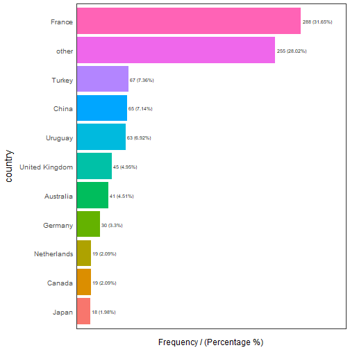
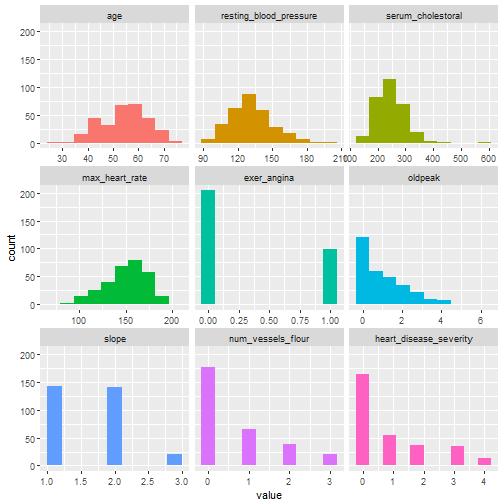
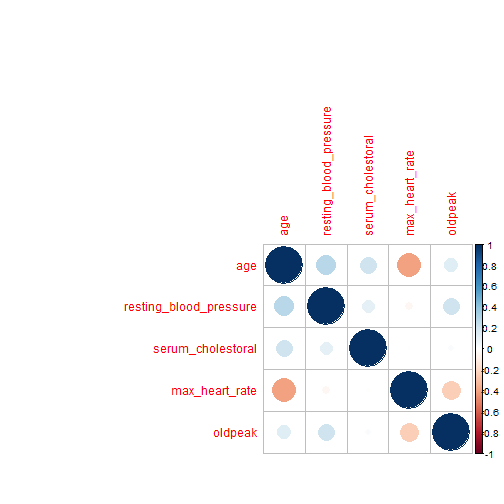
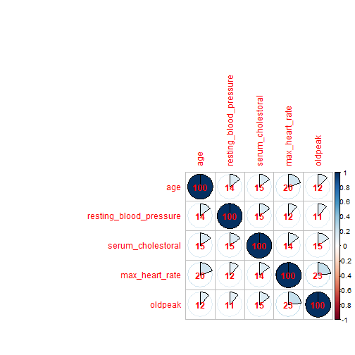
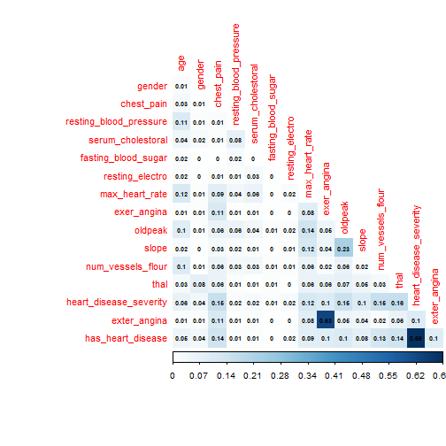
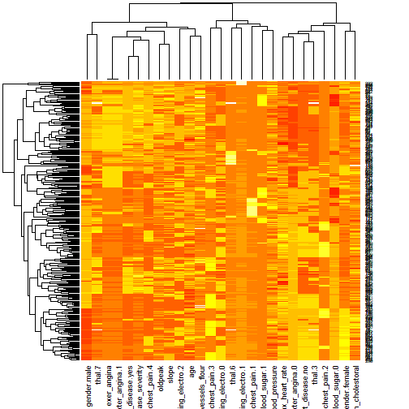
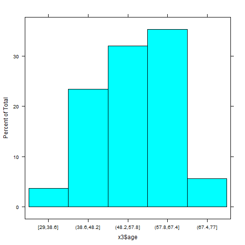
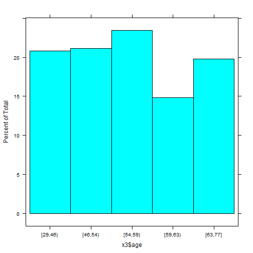
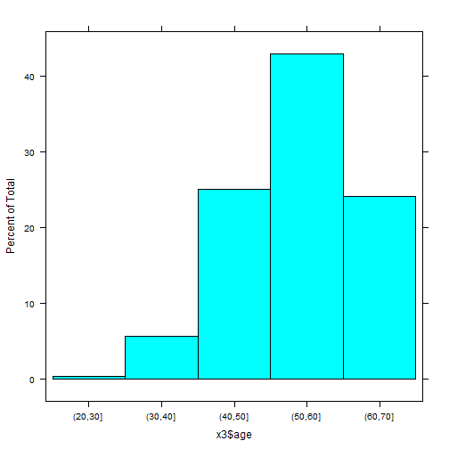
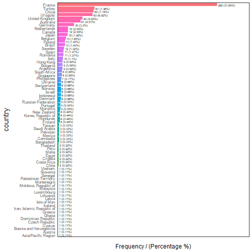

```r
#Libraries
library(Hmisc)
library(funModeling)
library(tidyverse)

#Working Directory
setwd (dir = "C:\\Users\\yousri.hajri\\Documents\\DATA_SCIENCE\\R_LIBRARY\\OUTPUT")

#Getting data
x <- heart_disease
attributes(x)
```

```
## $names
##  [1] "age"                    "gender"                
##  [3] "chest_pain"             "resting_blood_pressure"
##  [5] "serum_cholestoral"      "fasting_blood_sugar"   
##  [7] "resting_electro"        "max_heart_rate"        
##  [9] "exer_angina"            "oldpeak"               
## [11] "slope"                  "num_vessels_flour"     
## [13] "thal"                   "heart_disease_severity"
## [15] "exter_angina"           "has_heart_disease"     
## 
## $row.names
##   [1]   1   2   3   4   5   6   7   8   9  10  11  12  13  14  15  16  17
##  [18]  18  19  20  21  22  23  24  25  26  27  28  29  30  31  32  33  34
##  [35]  35  36  37  38  39  40  41  42  43  44  45  46  47  48  49  50  51
##  [52]  52  53  54  55  56  57  58  59  60  61  62  63  64  65  66  67  68
##  [69]  69  70  71  72  73  74  75  76  77  78  79  80  81  82  83  84  85
##  [86]  86  87  88  89  90  91  92  93  94  95  96  97  98  99 100 101 102
## [103] 103 104 105 106 107 108 109 110 111 112 113 114 115 116 117 118 119
## [120] 120 121 122 123 124 125 126 127 128 129 130 131 132 133 134 135 136
## [137] 137 138 139 140 141 142 143 144 145 146 147 148 149 150 151 152 153
## [154] 154 155 156 157 158 159 160 161 162 163 164 165 166 167 168 169 170
## [171] 171 172 173 174 175 176 177 178 179 180 181 182 183 184 185 186 187
## [188] 188 189 190 191 192 193 194 195 196 197 198 199 200 201 202 203 204
## [205] 205 206 207 208 209 210 211 212 213 214 215 216 217 218 219 220 221
## [222] 222 223 224 225 226 227 228 229 230 231 232 233 234 235 236 237 238
## [239] 239 240 241 242 243 244 245 246 247 248 249 250 251 252 253 254 255
## [256] 256 257 258 259 260 261 262 263 264 265 266 267 268 269 270 271 272
## [273] 273 274 275 276 277 278 279 280 281 282 283 284 285 286 287 288 289
## [290] 290 291 292 293 294 295 296 297 298 299 300 301 302 303
## 
## $class
## [1] "data.frame"
```

```r
#EDA UNIVARIATE
status <- df_status(x) ###DF for all variables
```

```
##                  variable q_zeros p_zeros q_na p_na q_inf p_inf    type
## 1                     age       0       0    0 0.00     0     0 integer
## 2                  gender       0       0    0 0.00     0     0  factor
## 3              chest_pain       0       0    0 0.00     0     0  factor
## 4  resting_blood_pressure       0       0    0 0.00     0     0 integer
## 5       serum_cholestoral       0       0    0 0.00     0     0 integer
## 6     fasting_blood_sugar     258      85    0 0.00     0     0  factor
## 7         resting_electro     151      50    0 0.00     0     0  factor
## 8          max_heart_rate       0       0    0 0.00     0     0 integer
## 9             exer_angina     204      67    0 0.00     0     0 integer
## 10                oldpeak      99      33    0 0.00     0     0 numeric
## 11                  slope       0       0    0 0.00     0     0 integer
## 12      num_vessels_flour     176      58    4 1.32     0     0 integer
## 13                   thal       0       0    2 0.66     0     0  factor
## 14 heart_disease_severity     164      54    0 0.00     0     0 integer
## 15           exter_angina     204      67    0 0.00     0     0  factor
## 16      has_heart_disease       0       0    0 0.00     0     0  factor
##    unique
## 1      41
## 2       2
## 3       4
## 4      50
## 5     152
## 6       2
## 7       3
## 8      91
## 9       2
## 10     40
## 11      3
## 12      4
## 13      3
## 14      5
## 15      2
## 16      2
```

```r
description <- describe(x); description ###List for all variables
```

```
## x 
## 
##  16  Variables      303  Observations
## ---------------------------------------------------------------------------
## age 
##        n  missing distinct     Info     Mean      Gmd      .05      .10 
##      303        0       41    0.999    54.44     10.3       40       42 
##      .25      .50      .75      .90      .95 
##       48       56       61       66       68 
## 
## lowest : 29 34 35 37 38, highest: 70 71 74 76 77
## ---------------------------------------------------------------------------
## gender 
##        n  missing distinct 
##      303        0        2 
##                         
## Value      female   male
## Frequency      97    206
## Proportion   0.32   0.68
## ---------------------------------------------------------------------------
## chest_pain 
##        n  missing distinct 
##      303        0        4 
##                                   
## Value          1     2     3     4
## Frequency     23    50    86   144
## Proportion 0.076 0.165 0.284 0.475
## ---------------------------------------------------------------------------
## resting_blood_pressure 
##        n  missing distinct     Info     Mean      Gmd      .05      .10 
##      303        0       50    0.995    131.7    19.41      108      110 
##      .25      .50      .75      .90      .95 
##      120      130      140      152      160 
## 
## lowest :  94 100 101 102 104, highest: 174 178 180 192 200
## ---------------------------------------------------------------------------
## serum_cholestoral 
##        n  missing distinct     Info     Mean      Gmd      .05      .10 
##      303        0      152        1    246.7    55.91    175.1    188.8 
##      .25      .50      .75      .90      .95 
##    211.0    241.0    275.0    308.8    326.9 
## 
## lowest : 126 131 141 149 157, highest: 394 407 409 417 564
## ---------------------------------------------------------------------------
## fasting_blood_sugar 
##        n  missing distinct 
##      303        0        2 
##                     
## Value         0    1
## Frequency   258   45
## Proportion 0.85 0.15
## ---------------------------------------------------------------------------
## resting_electro 
##        n  missing distinct 
##      303        0        3 
##                             
## Value          0     1     2
## Frequency    151     4   148
## Proportion 0.498 0.013 0.488
## ---------------------------------------------------------------------------
## max_heart_rate 
##        n  missing distinct     Info     Mean      Gmd      .05      .10 
##      303        0       91        1    149.6    25.73    108.1    116.0 
##      .25      .50      .75      .90      .95 
##    133.5    153.0    166.0    176.6    181.9 
## 
## lowest :  71  88  90  95  96, highest: 190 192 194 195 202
## ---------------------------------------------------------------------------
## exer_angina 
##        n  missing distinct     Info      Sum     Mean      Gmd 
##      303        0        2     0.66       99   0.3267   0.4414 
## 
## ---------------------------------------------------------------------------
## oldpeak 
##        n  missing distinct     Info     Mean      Gmd      .05      .10 
##      303        0       40    0.964     1.04    1.225      0.0      0.0 
##      .25      .50      .75      .90      .95 
##      0.0      0.8      1.6      2.8      3.4 
## 
## lowest : 0.0 0.1 0.2 0.3 0.4, highest: 4.0 4.2 4.4 5.6 6.2
## ---------------------------------------------------------------------------
## slope 
##        n  missing distinct     Info     Mean      Gmd 
##      303        0        3    0.798    1.601   0.6291 
##                             
## Value          1     2     3
## Frequency    142   140    21
## Proportion 0.469 0.462 0.069
## ---------------------------------------------------------------------------
## num_vessels_flour 
##        n  missing distinct     Info     Mean      Gmd 
##      299        4        4    0.783   0.6722   0.9249 
##                                   
## Value          0     1     2     3
## Frequency    176    65    38    20
## Proportion 0.589 0.217 0.127 0.067
## ---------------------------------------------------------------------------
## thal 
##        n  missing distinct 
##      301        2        3 
##                          
## Value         3    6    7
## Frequency   166   18  117
## Proportion 0.55 0.06 0.39
## ---------------------------------------------------------------------------
## heart_disease_severity 
##        n  missing distinct     Info     Mean      Gmd 
##      303        0        5    0.832   0.9373     1.25 
##                                         
## Value          0     1     2     3     4
## Frequency    164    55    36    35    13
## Proportion 0.541 0.182 0.119 0.116 0.043
## ---------------------------------------------------------------------------
## exter_angina 
##        n  missing distinct 
##      303        0        2 
##                     
## Value         0    1
## Frequency   204   99
## Proportion 0.67 0.33
## ---------------------------------------------------------------------------
## has_heart_disease 
##        n  missing distinct 
##      303        0        2 
##                     
## Value        no  yes
## Frequency   164  139
## Proportion 0.54 0.46
## ---------------------------------------------------------------------------
```

```r
freq <- freq(x, path_out="feq_plot.jpg") ###for categorical (factor)
```

```
##   gender frequency percentage cumulative_perc
## 1   male       206         68              68
## 2 female        97         32             100
```

```
##   chest_pain frequency percentage cumulative_perc
## 1          4       144       47.5              48
## 2          3        86       28.4              76
## 3          2        50       16.5              92
## 4          1        23        7.6             100
```

```
##   fasting_blood_sugar frequency percentage cumulative_perc
## 1                   0       258         85              85
## 2                   1        45         15             100
```

```
##   resting_electro frequency percentage cumulative_perc
## 1               0       151       49.8              50
## 2               2       148       48.8              99
## 3               1         4        1.3             100
```

```
##   thal frequency percentage cumulative_perc
## 1    3       166      54.79              55
## 2    7       117      38.61              93
## 3    6        18       5.94              99
## 4 <NA>         2       0.66             100
```

```
##   exter_angina frequency percentage cumulative_perc
## 1            0       204         67              67
## 2            1        99         33             100
```

```
##   has_heart_disease frequency percentage cumulative_perc
## 1                no       164         54              54
## 2               yes       139         46             100
```

```r
profiling <- profiling_num(x) ###for numerical (integer, numeric)
```



```
##                 variable   mean std_dev variation_coef p_01 p_05 p_25
## 1                    age  54.44    9.04           0.17   35   40   48
## 2 resting_blood_pressure 131.69   17.60           0.13  100  108  120
## 3      serum_cholestoral 246.69   51.78           0.21  149  175  211
## 4         max_heart_rate 149.61   22.88           0.15   95  108  134
## 5            exer_angina   0.33    0.47           1.44    0    0    0
## 6                oldpeak   1.04    1.16           1.12    0    0    0
## 7                  slope   1.60    0.62           0.38    1    1    1
## 8      num_vessels_flour   0.67    0.94           1.39    0    0    0
## 9 heart_disease_severity   0.94    1.23           1.31    0    0    0
##    p_50  p_75  p_95  p_99 skewness kurtosis  iqr        range_98
## 1  56.0  61.0  68.0  71.0    -0.21      2.5 13.0        [35, 71]
## 2 130.0 140.0 160.0 180.0     0.70      3.8 20.0      [100, 180]
## 3 241.0 275.0 326.9 406.7     1.13      7.4 64.0   [149, 406.74]
## 4 153.0 166.0 181.9 192.0    -0.53      2.9 32.5 [95.02, 191.96]
## 5   0.0   1.0   1.0   1.0     0.74      1.5  1.0          [0, 1]
## 6   0.8   1.6   3.4   4.2     1.26      4.5  1.6        [0, 4.2]
## 7   2.0   2.0   3.0   3.0     0.51      2.4  1.0          [1, 3]
## 8   0.0   1.0   3.0   3.0     1.18      3.2  1.0          [0, 3]
## 9   0.0   2.0   3.0   4.0     1.05      2.8  2.0          [0, 4]
##         range_80
## 1       [42, 66]
## 2     [110, 152]
## 3 [188.8, 308.8]
## 4   [116, 176.6]
## 5         [0, 1]
## 6       [0, 2.8]
## 7         [1, 2]
## 8         [0, 2]
## 9         [0, 3]
```

```r
plot <- plot_num(x); plot ###Hist plot for numerical variables
```



```r
#EDA BIVARIATE _ correlation

###Calculating R
cor(select(x, age, resting_blood_pressure, serum_cholestoral, max_heart_rate, oldpeak))
```

```
##                          age resting_blood_pressure serum_cholestoral
## age                     1.00                  0.285            0.2090
## resting_blood_pressure  0.28                  1.000            0.1301
## serum_cholestoral       0.21                  0.130            1.0000
## max_heart_rate         -0.39                 -0.045           -0.0034
## oldpeak                 0.20                  0.189            0.0466
##                        max_heart_rate oldpeak
## age                           -0.3938   0.204
## resting_blood_pressure        -0.0454   0.189
## serum_cholestoral             -0.0034   0.047
## max_heart_rate                 1.0000  -0.343
## oldpeak                       -0.3431   1.000
```

```r
###Calculating R2
cor(select(x, age, resting_blood_pressure, serum_cholestoral, max_heart_rate, oldpeak)^2)
```

```
##                          age resting_blood_pressure serum_cholestoral
## age                     1.00                  0.280            0.2015
## resting_blood_pressure  0.28                  1.000            0.1104
## serum_cholestoral       0.20                  0.110            1.0000
## max_heart_rate         -0.40                 -0.049           -0.0098
## oldpeak                 0.13                  0.204            0.0270
##                        max_heart_rate oldpeak
## age                           -0.4013   0.132
## resting_blood_pressure        -0.0487   0.204
## serum_cholestoral             -0.0098   0.027
## max_heart_rate                 1.0000  -0.243
## oldpeak                       -0.2425   1.000
```

```r
library(corrplot)
library(minerva) # contains MIC statistic Maximal Information-based nonparametric exploration
correlation_table(x, str_target = "has_heart_disease")
```

```
##                 Variable has_heart_disease
## 1      has_heart_disease              1.00
## 2 heart_disease_severity              0.83
## 3      num_vessels_flour              0.46
## 4                oldpeak              0.42
## 5                  slope              0.34
## 6                    age              0.23
## 7 resting_blood_pressure              0.15
## 8      serum_cholestoral              0.08
## 9         max_heart_rate             -0.42
```

```r
mic <- mine(select(x, age, resting_blood_pressure, serum_cholestoral, max_heart_rate, oldpeak))
###MIC value goes from 0 to 1. Being 0 implies no correlation and 1 highest correlation
###The interpretation is the same as the R-squared.
corrplot(cor(select(x, age, resting_blood_pressure, serum_cholestoral, max_heart_rate, oldpeak)^2))
```



```r
corrplot(mic$MIC, method = "pie", diag=T, addCoef.col = "red", addCoefasPercent = T)
```



```r
###Discretizing x to get all numeric
library(infotheo)
y <- discretize(x) %>% mutinformation()
diag(y)=0
corrplot(y, method = "color", type = "lower",
         number.cex = 0.6, addCoef.col = "black",
         tl.col = "red", tl.srt = 90, tl.cex = 0.9,
         diag = FALSE, is.corr = F)
```



```r
#Converting categorical variables into numerical
library(caret) 
dmy = dummyVars(" ~ .", data = heart_disease) 
x2 = data.frame(predict(dmy, newdata = heart_disease))
heatmap(as.matrix(scale(x2)))
```



```r
#Discretizing numerical variables
##The most standard binning criteria are: . Equal range . Equal frequency . Custom bins
###Equal range
x3 <- x
x3$age <- cut_interval(x3$age, 5)
describe(x3$age)
```

```
## x3$age 
##        n  missing distinct 
##      303        0        5 
##                                                                       
## Value        [29,38.6] (38.6,48.2] (48.2,57.8] (57.8,67.4]   (67.4,77]
## Frequency           11          71          97         107          17
## Proportion       0.036       0.234       0.320       0.353       0.056
```

```r
histogram(x3$age)
```



```r
###Equal frequency
x3 <- x
x3$age <- equal_freq(x3$age, n_bins=5)
describe(x3$age)
```

```
## x3$age 
##        n  missing distinct 
##      303        0        5 
##                                                   
## Value      [29,46) [46,54) [54,59) [59,63) [63,77]
## Frequency       63      64      71      45      60
## Proportion    0.21    0.21    0.23    0.15    0.20
```

```r
histogram(x3$age)
```



```r
###Custom bins
x3 <- x
x3$age <- cut(x3$age, breaks=c(20,30,40,50,60,70))
describe(x3$age)
```

```
## x3$age 
##        n  missing distinct 
##      297        6        5 
##                                                   
## Value      (20,30] (30,40] (40,50] (50,60] (60,70]
## Frequency        1      17      76     130      73
## Proportion   0.003   0.057   0.256   0.438   0.246
```

```r
histogram(x3$age)
```



```r
###New data arrival
new_data_x3_age <- c(x3$age, 80,82,85)
describe(new_data_x3_age) #predictive model will fail
```

```
## new_data_x3_age 
##        n  missing distinct     Info     Mean      Gmd 
##      300        6        8    0.888     4.65    2.468 
##                                                           
## Value          1     2     3     4     5    80    82    85
## Frequency      1    17    76   130    73     1     1     1
## Proportion 0.003 0.057 0.253 0.433 0.243 0.003 0.003 0.003
```

```r
###High cardinality, creating factor "other"
data <- funModeling::data_country
freq(data, "country")
```



```
##                      country frequency percentage cumulative_perc
## 1                     France       288      31.65              32
## 2                     Turkey        67       7.36              39
## 3                      China        65       7.14              46
## 4                    Uruguay        63       6.92              53
## 5             United Kingdom        45       4.95              58
## 6                  Australia        41       4.51              63
## 7                    Germany        30       3.30              66
## 8                     Canada        19       2.09              68
## 9                Netherlands        19       2.09              70
## 10                     Japan        18       1.98              72
## 11                   Belgium        15       1.65              74
## 12                    Brazil        13       1.43              75
## 13                    Poland        13       1.43              76
## 14                    Sweden        12       1.32              78
## 15                   Romania        11       1.21              79
## 16                     Spain        11       1.21              80
## 17                     Italy        10       1.10              81
## 18                 Argentina         9       0.99              82
## 19                  Bulgaria         9       0.99              83
## 20                 Hong Kong         9       0.99              84
## 21                 Singapore         8       0.88              85
## 22              South Africa         8       0.88              86
## 23               Philippines         7       0.77              87
## 24                   Denmark         6       0.66              88
## 25                 Indonesia         6       0.66              88
## 26                    Israel         6       0.66              89
## 27                    Norway         6       0.66              89
## 28               Switzerland         6       0.66              90
## 29                   Ukraine         6       0.66              91
## 30                   Morocco         5       0.55              91
## 31                  Portugal         5       0.55              92
## 32        Russian Federation         5       0.55              92
## 33                   Finland         4       0.44              93
## 34                  Honduras         4       0.44              93
## 35        Korea, Republic of         4       0.44              94
## 36               New Zealand         4       0.44              94
## 37                Bangladesh         3       0.33              95
## 38                  Cambodia         3       0.33              95
## 39                    Mexico         3       0.33              95
## 40                  Pakistan         3       0.33              96
## 41              Saudi Arabia         3       0.33              96
## 42                    Taiwan         3       0.33              96
## 43                     Chile         2       0.22              96
## 44                Costa Rica         2       0.22              97
## 45                   Croatia         2       0.22              97
## 46                     Egypt         2       0.22              97
## 47                     Malta         2       0.22              97
## 48                      Peru         2       0.22              98
## 49                  Thailand         2       0.22              98
## 50       Asia/Pacific Region         1       0.11              98
## 51                   Austria         1       0.11              98
## 52    Bosnia and Herzegovina         1       0.11              98
## 53                    Cyprus         1       0.11              98
## 54            Czech Republic         1       0.11              98
## 55        Dominican Republic         1       0.11              98
## 56                     Ghana         1       0.11              98
## 57                    Greece         1       0.11              99
## 58 Iran, Islamic Republic of         1       0.11              99
## 59                   Ireland         1       0.11              99
## 60               Isle of Man         1       0.11              99
## 61                    Latvia         1       0.11              99
## 62                 Lithuania         1       0.11              99
## 63                Luxembourg         1       0.11              99
## 64                  Malaysia         1       0.11              99
## 65      Moldova, Republic of         1       0.11              99
## 66                Montenegro         1       0.11             100
## 67     Palestinian Territory         1       0.11             100
## 68                   Senegal         1       0.11             100
## 69                  Slovenia         1       0.11             100
## 70                   Vietnam         1       0.11             100
```

```r
data$country <- ifelse(data$country %in% freq(data, "country", plot=F)[1:10,]$country, 
                       data$country,
                       "other")
freq(data, "country")
```


```
##           country frequency percentage cumulative_perc
## 1          France       288       31.6              32
## 2           other       255       28.0              60
## 3          Turkey        67        7.4              67
## 4           China        65        7.1              74
## 5         Uruguay        63        6.9              81
## 6  United Kingdom        45        5.0              86
## 7       Australia        41        4.5              91
## 8         Germany        30        3.3              94
## 9          Canada        19        2.1              96
## 10    Netherlands        19        2.1              98
## 11          Japan        18        2.0             100
```

```r
country_profiling <- categ_analysis(data, input = "country", target = "has_flu")

###High cardinality automatic grouping with care about the target variable

country_groups <- auto_grouping(data = data_country, input = "country",
                               target = "has_flu", n_groups = 9, seed = 999) 

head(country_groups$df_equivalence) ###If Argentine and Chile are in group_1, 
```

```
##     country country_rec
## 1 Australia     group_1
## 2    Canada     group_1
## 3   Germany     group_1
## 4    France     group_2
## 5     China     group_3
## 6    Turkey     group_3
```

```r
###then they are the same, and this is how the model will see it
```

